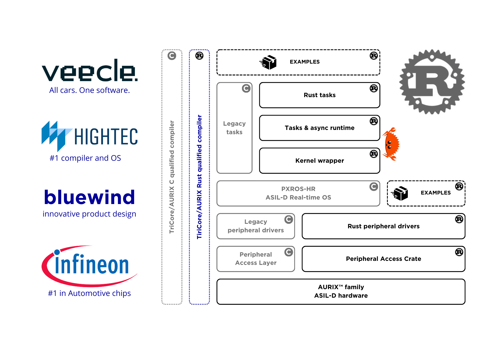

# AURIX™ Rust Startup Ecosystem

The AURIX™ Rust Startup Ecosystem is a collaborative effort involving [Veecle](https://www.veecle.io), [Infineon](https://www.infineon.com), [HighTec](https://hightec-rt.com) and [Bluewind](https://www.bluewind.it) aimed at supporting Rust on Infineon's AURIX™ architecture for automotive and industrial applications. The primary objective is to empower customers to seamlessly integrate Rust tasks alongside existing C implementations for evaluation and pre-development purposes.

  

The AURIX™ Rust Startup Ecosystem consists of:
* A [Peripheral Access Crate](https://github.com/Infineon/tc375-pac) (PAC) from Infineon.
* [Low-level drivers](https://github.com/bluewind-embedded-systems/bw-r-drivers-tc37x) from Bluewind, fully written in Rust.
* A precompiled version of [PXROS-HR](https://hightec-rt.com/en/products/real-time-os), an ASIL-D RTOS written in C, developed by HighTec.
* Rust [PXROS-HR bindings](https://github.com/hightec-rt/pxros) developed jointly by Veecle and HighTec.
* A Rust runtime from Veecle, named [veecle-pxros](https://github.com/veecle/veecle-pxros), which seamlessly integrates with PXROS-HR, providing a native Rust experience. This runtime also supports asynchronous execution where feasible.
* A curated set of examples by Veecle and Bluewind, covering bare metal driver examples, driver instances employing PXROS-HR, and connectivity application demonstrations.

For compiling Rust for AURIX™, HighTec offers a combined package of their Rust and C/C++ compiler, accessible [here](https://hightec-rt.com/en/products/development-platform).

Finally, to facilitate flashing and debugging on AURIX Veecle is maintaining the [tricore-probe](https://github.com/veecle/tricore-probe).

For additional information visit:
* https://www.veecle.io/aurix
* https://www.bluewind.it/rust
* https://hightec-rt.com/en/rust
